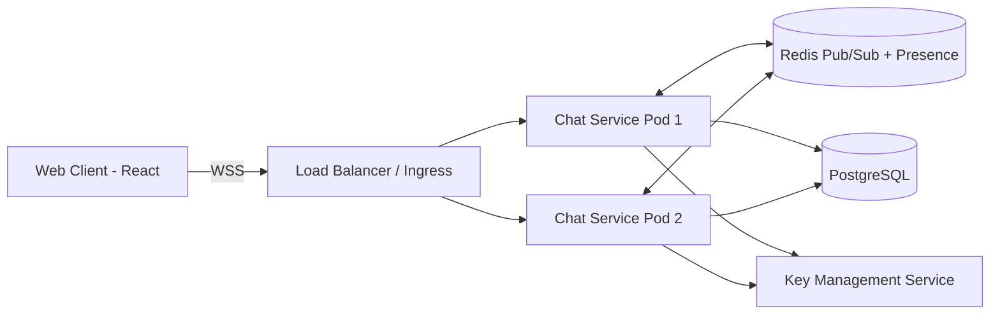
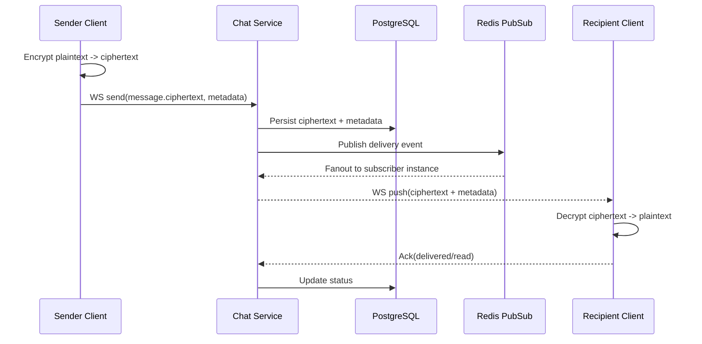

# Technical Design: Real-Time Chat Feature

## 1) Problem Statement

Add a real-time chat capability to the employee management app with:

- WebSocket-based low-latency messaging
- Message persistence in PostgreSQL
- Support for 10,000 concurrent users
- End-to-end encryption (E2EE)

---

## 2) Proposed Solution

Implement a dedicated Chat Service (Node.js) with:

- **WebSocket gateway** for live messaging
- **PostgreSQL** for durable message/event storage
- **Redis Pub/Sub** for cross-instance fanout and presence
- **E2EE protocol** where server stores/transports only ciphertext
- **React chat client module** integrated into current frontend

### High-level Architecture



### Message Flow



---

## 3) Component Breakdown & Responsibilities

1. **Chat Web Client (frontend)**
   - Manage WebSocket lifecycle/reconnect
   - Local encryption/decryption and key ratchets
   - Render conversations, history, typing indicators, and presence
   - Store device keys securely (WebCrypto + IndexedDB)

2. **Chat Service (backend)**
   - Authenticate WS session (JWT)
   - Validate message envelopes and authorization
   - Persist encrypted payloads and delivery states
   - Publish/consume realtime events via Redis
   - Never decrypt content

3. **PostgreSQL**
   - Durable source of truth for chats, messages, and delivery status
   - Indexed retrieval for conversation history

4. **Redis**
   - Cross-instance message fanout
   - Presence and ephemeral typing indicators

5. **KMS / Secrets Manager**
   - Store server-side signing keys and envelope secrets
   - Rotate secrets and enforce access policy

---

## 4) API Design

### WebSocket (Primary)

- **Connect:** `wss://.../chat?token=<jwt>`

**Client → Server events:**

| Event | Description |
|---|---|
| `chat.send` | Send an encrypted message |
| `chat.ack` | Acknowledge delivery or read |
| `typing.start` | Indicate typing has started |
| `typing.stop` | Indicate typing has stopped |
| `presence.update` | Update online/away status |

**Server → Client events:**

| Event | Description |
|---|---|
| `chat.message` | Deliver an encrypted message |
| `chat.status` | Update message delivery/read status |
| `presence.changed` | Notify of participant presence change |
| `error` | Report an error |

#### `chat.send` Payload

```json
{
  "conversationId": "uuid",
  "clientMessageId": "uuid",
  "ciphertext": "base64",
  "nonce": "base64",
  "keyEnvelope": [
    { "userId": "uuid", "wrappedKey": "base64" }
  ],
  "sentAt": "ISO-8601"
}
```

### REST (Secondary)

| Method | Endpoint | Description |
|---|---|---|
| `GET` | `/api/chat/conversations` | List conversations for authenticated user |
| `GET` | `/api/chat/conversations/:id/messages?before=<cursor>&limit=50` | Paginated message history |
| `POST` | `/api/chat/conversations` | Create a new conversation |
| `GET` | `/api/chat/keys/prekeys/:userId` | Fetch public pre-key bundle for a user |

---

## 5) Data Model (PostgreSQL)

### `chat_conversations`

| Column | Type | Notes |
|---|---|---|
| `id` | UUID | Primary key |
| `type` | TEXT | `direct` or `group` |
| `created_at` | TIMESTAMPTZ | |
| `created_by` | UUID | FK → employees |

### `chat_participants`

| Column | Type | Notes |
|---|---|---|
| `conversation_id` | UUID | FK → chat_conversations |
| `user_id` | UUID | FK → employees |
| `joined_at` | TIMESTAMPTZ | |
| `role` | TEXT | `member` or `admin` |

### `chat_messages`

| Column | Type | Notes |
|---|---|---|
| `id` | UUID | Primary key |
| `conversation_id` | UUID | FK → chat_conversations |
| `sender_id` | UUID | FK → employees |
| `client_message_id` | UUID | Sender-assigned dedup ID |
| `ciphertext` | BYTEA | Encrypted payload |
| `nonce` | BYTEA | Encryption nonce |
| `sent_at` | TIMESTAMPTZ | Client timestamp |
| `server_received_at` | TIMESTAMPTZ | Server timestamp |

### `chat_message_keys`

| Column | Type | Notes |
|---|---|---|
| `message_id` | UUID | FK → chat_messages |
| `recipient_user_id` | UUID | FK → employees |
| `wrapped_key` | BYTEA | Per-recipient encrypted symmetric key |

### `chat_receipts`

| Column | Type | Notes |
|---|---|---|
| `message_id` | UUID | FK → chat_messages |
| `user_id` | UUID | FK → employees |
| `status` | TEXT | `sent`, `delivered`, or `read` |
| `updated_at` | TIMESTAMPTZ | |

### `chat_devices`

| Column | Type | Notes |
|---|---|---|
| `id` | UUID | Primary key |
| `user_id` | UUID | FK → employees |
| `device_id` | TEXT | Client device identifier |
| `identity_public_key` | BYTEA | Long-term identity key |
| `signed_prekey` | BYTEA | Signed pre-key |
| `prekey_bundle` | JSONB | One-time pre-keys |
| `updated_at` | TIMESTAMPTZ | |

> **Note:** Message content is stored as `ciphertext` only — no plaintext is ever persisted.

---

## 6) Security Considerations

| Concern | Approach |
|---|---|
| **E2EE** | Encryption/decryption happens only on clients; server never sees plaintext |
| **Cryptographic Protocol** | X25519 key exchange + signed prekeys + per-message symmetric keys (Double Ratchet for 1:1; Sender Keys for groups) |
| **Transport Security** | TLS 1.2+ enforced; WebSocket upgrade only over `wss://` |
| **Authentication** | JWT validated on WS connect; per-event conversation membership check |
| **Replay Protection** | Nonce + monotonic message sequencing + server-side dedup via `client_message_id` uniqueness per sender |
| **Key Rotation** | Device-level keys; forced rekey on device removal or compromise |
| **Rate Limiting** | Per-user message rate limits and maximum message size enforced at gateway |
| **Audit Logging** | Metadata-only logs; plaintext never logged |
| **Encryption at Rest** | PostgreSQL and Redis volumes encrypted; backups encrypted |

---

## 7) Performance & Scalability Requirements

**Target:** 10,000 concurrent users

### Capacity Design

- **6–10 Chat Service instances**, each handling ~1,500–2,000 live sockets (autoscaled horizontally)
- **Redis-backed fanout** to avoid single-node bottlenecks across instances
- **PostgreSQL** tuning:
  - Partition `chat_messages` by time or conversation hash bucket
  - Index on `(conversation_id, sent_at DESC)` for history queries
  - Index on `(sender_id, client_message_id)` for deduplication

### Service Level Objectives (SLOs)

| Metric | Target |
|---|---|
| p95 message delivery latency (online recipient) | < 300 ms |
| p99 WS event handling latency | < 800 ms |
| Message durability success rate | 99.99% |
| WebSocket service uptime | 99.9% |

---

## 8) Deployment Strategy

### Infrastructure

- **Chat Service:** Containerized, deployed on Kubernetes with HPA (Horizontal Pod Autoscaler)
- **Ingress/Load Balancer:** Configured with WebSocket support and appropriate idle timeout tuning
- **Redis:** Managed service (e.g., AWS ElastiCache or GCP Memorystore)
- **PostgreSQL:** Managed service with HA failover (e.g., AWS RDS or Cloud SQL); read replica optional for history queries

### Release Strategy

- **Blue/green or canary deployments** to minimize rollout risk
- Feature flags to gate chat access during rollout

### Observability

| Category | Metrics |
|---|---|
| **Application Metrics** | Active connections, fanout lag, DB write latency, delivery latency histograms |
| **Tracing** | Distributed traces across WS event pipeline |
| **Logging** | Structured logs; no plaintext message content ever logged |

### Disaster Recovery

- **Point-in-time recovery (PITR)** backups for PostgreSQL
- **Multi-AZ deployment** for Chat Service and data stores
- **RTO:** < 1 hour; **RPO:** < 5 minutes

---

## 9) Trade-offs & Alternatives Considered

### WebSocket vs. Server-Sent Events (SSE)

| | WebSocket | SSE |
|---|---|---|
| **Direction** | Bidirectional | Server → Client only |
| **Overhead** | Lower for chat | Higher for client→server signaling |
| **Decision** | ✅ Chosen | — |

SSE is simpler but inadequate for bidirectional chat signaling without a separate REST channel.

### End-to-End Encryption vs. Server-Side Encryption

| | E2EE | Server-Side Encryption |
|---|---|---|
| **Privacy** | Server never sees plaintext | Server can access plaintext |
| **Complexity** | Higher implementation effort | Lower |
| **Trust Model** | Stronger | Weaker |
| **Decision** | ✅ Chosen | — |

E2EE is required by the problem statement and provides the strongest privacy guarantees.

### PostgreSQL vs. NoSQL (e.g., Cassandra, DynamoDB)

| | PostgreSQL | NoSQL |
|---|---|---|
| **Consistency** | Strong (ACID) | Eventual (typically) |
| **Query Model** | Relational, flexible | Limited, query-by-key |
| **Operational Maturity** | High | Varies |
| **Write Scalability** | Good (with partitioning) | Higher ceiling |
| **Decision** | ✅ Chosen | — |

PostgreSQL is sufficient for 10,000 concurrent users with proper partitioning and indexing, and aligns with existing relational data modeling for employees.

### Redis Requirement

Redis is required to enable stateless horizontal scaling of Chat Service pods. Without Redis, sticky sessions would be required, limiting scale and resilience.

---

## 10) Success Metrics

### Functional

- 100% of message payloads stored as ciphertext only (validated by automated test)
- Real-time send/receive, delivery receipts, and read receipts work correctly across all service instances

### Scale

- Sustained load test passes at 10,000 concurrent WebSocket connections with SLOs met

### Reliability

- < 0.1% failed sends (excluding expected client disconnects)
- Zero data loss incidents in a 30-day post-launch window

### Security

- No server plaintext exposure in logs, database, or monitoring tools (verified by security review)
- Key rotation and device revocation workflows verified in pre-launch penetration testing
